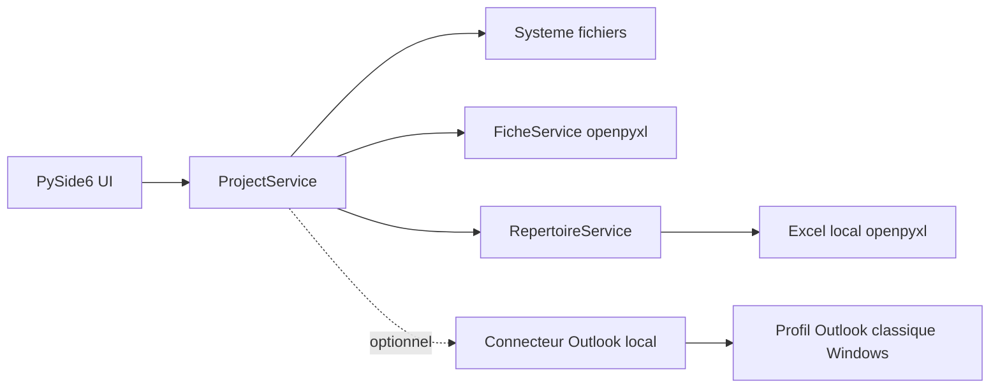
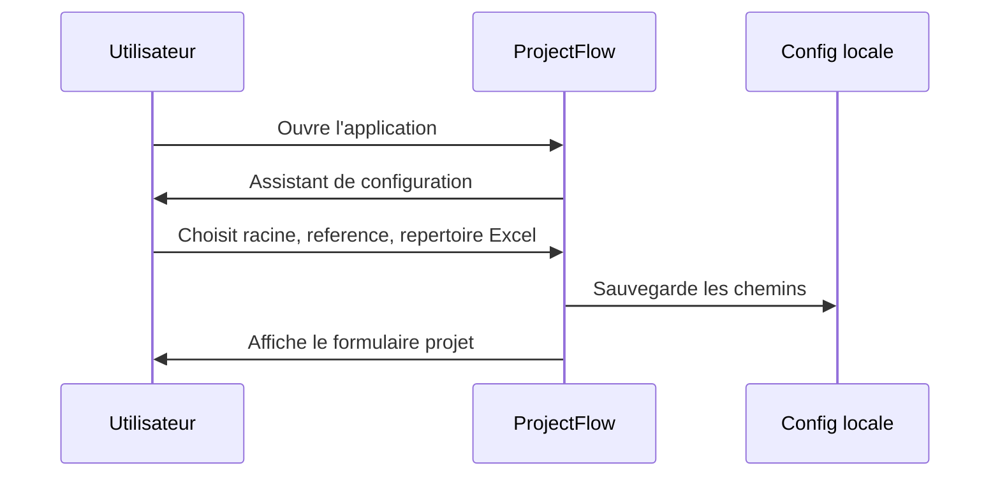
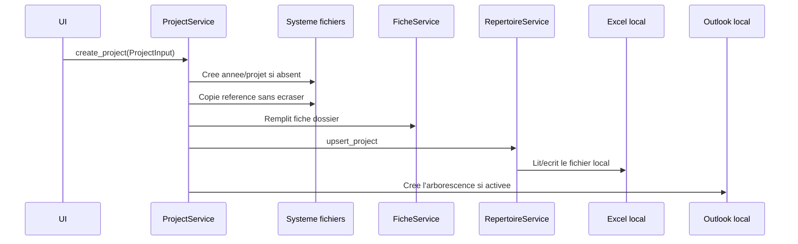
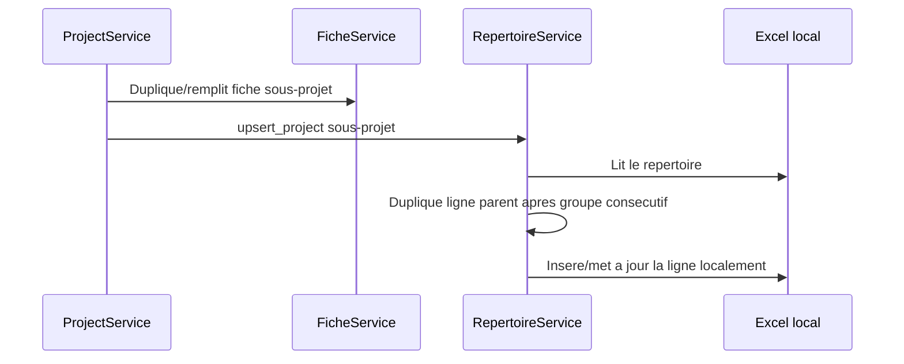

# Architecture

ProjectFlow separe strictement UI, logique metier et integrations locales.

```mermaid
flowchart LR
  UI["PySide6 UI"] --> Service["ProjectService"]
  Service --> FS["Systeme fichiers"]
  Service --> Fiche["FicheService openpyxl"]
  Service --> Repertoire["RepertoireService"]
  Repertoire --> Excel["Excel local openpyxl"]
  Service -. optionnel .-> Outlook["Connecteur Outlook local"]
  Outlook --> WinOutlook["Profil Outlook classique Windows"]
```

## Premier lancement

```mermaid
sequenceDiagram
  participant User as Utilisateur
  participant App as ProjectFlow
  participant Config as Config locale

  User->>App: Ouvre l'application
  App->>User: Assistant de configuration
  User->>App: Choisit racine, reference, repertoire Excel
  App->>Config: Sauvegarde les chemins
  App->>User: Affiche le formulaire projet
```

## Creation Projet Principal

```mermaid
sequenceDiagram
  participant UI as UI
  participant Service as ProjectService
  participant FS as Systeme fichiers
  participant Fiche as FicheService
  participant Rep as RepertoireService
  participant Excel as Excel local
  participant Outlook as Outlook local

  UI->>Service: create_project(ProjectInput)
  Service->>FS: Cree annee/projet si absent
  Service->>FS: Copie reference sans ecraser
  Service->>Fiche: Remplit fiche dossier
  Service->>Rep: upsert_project
  Rep->>Excel: Lit/ecrit le fichier local
  Service->>Outlook: Cree l'arborescence si activee
```

## Sous-projet

```mermaid
sequenceDiagram
  participant Service as ProjectService
  participant Fiche as FicheService
  participant Rep as RepertoireService
  participant Excel as Excel local

  Service->>Fiche: Duplique/remplit fiche sous-projet
  Service->>Rep: upsert_project sous-projet
  Rep->>Excel: Lit le repertoire
  Rep->>Rep: Duplique ligne parent apres groupe consecutif
  Rep->>Excel: Insere/met a jour la ligne localement
```
