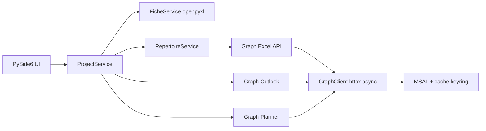
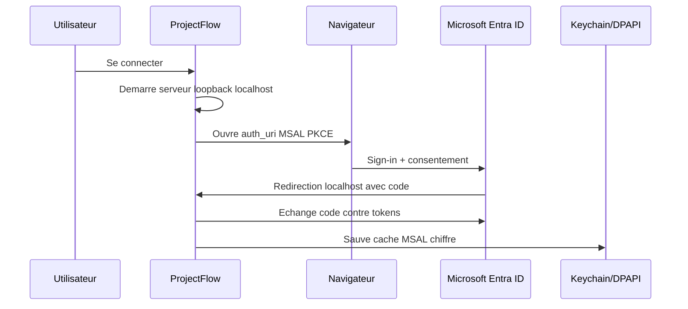
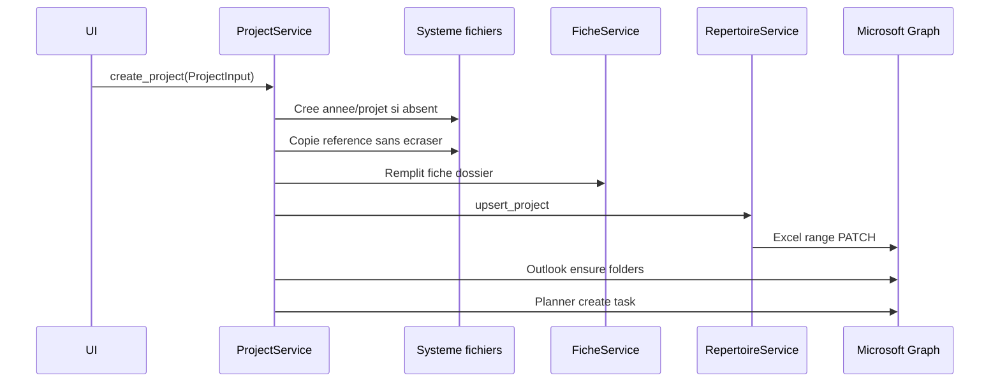
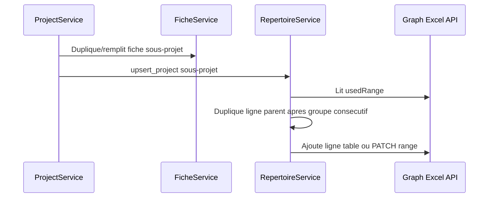

# Architecture

ProjectFlow separe strictement UI, logique metier et integrations Microsoft Graph.

```mermaid
flowchart LR
  UI["PySide6 UI"] --> Service["ProjectService"]
  Service --> Fiche["FicheService openpyxl"]
  Service --> Repertoire["RepertoireService"]
  Repertoire --> Excel["Graph Excel API"]
  Service --> Outlook["Graph Outlook"]
  Service --> Planner["Graph Planner"]
  Excel --> Graph["GraphClient httpx async"]
  Outlook --> Graph
  Planner --> Graph
  Graph --> Auth["MSAL + cache keyring"]
```

## Authentification

```mermaid
sequenceDiagram
  participant User as Utilisateur
  participant App as ProjectFlow
  participant Browser as Navigateur
  participant Entra as Microsoft Entra ID
  participant Keyring as Keychain/DPAPI

  User->>App: Se connecter
  App->>App: Demarre serveur loopback localhost
  App->>Browser: Ouvre auth_uri MSAL PKCE
  Browser->>Entra: Sign-in + consentement
  Entra->>App: Redirection localhost avec code
  App->>Entra: Echange code contre tokens
  App->>Keyring: Sauve cache MSAL chiffre
```

## Creation Projet Principal

```mermaid
sequenceDiagram
  participant UI as UI
  participant Service as ProjectService
  participant FS as Systeme fichiers
  participant Fiche as FicheService
  participant Rep as RepertoireService
  participant Graph as Microsoft Graph

  UI->>Service: create_project(ProjectInput)
  Service->>FS: Cree annee/projet si absent
  Service->>FS: Copie reference sans ecraser
  Service->>Fiche: Remplit fiche dossier
  Service->>Rep: upsert_project
  Rep->>Graph: Excel range PATCH
  Service->>Graph: Outlook ensure folders
  Service->>Graph: Planner create task
```

## Sous-projet

```mermaid
sequenceDiagram
  participant Service as ProjectService
  participant Fiche as FicheService
  participant Rep as RepertoireService
  participant Excel as Graph Excel API

  Service->>Fiche: Duplique/remplit fiche sous-projet
  Service->>Rep: upsert_project sous-projet
  Rep->>Excel: Lit usedRange
  Rep->>Rep: Duplique ligne parent apres groupe consecutif
  Rep->>Excel: Ajoute ligne table ou PATCH range
```
