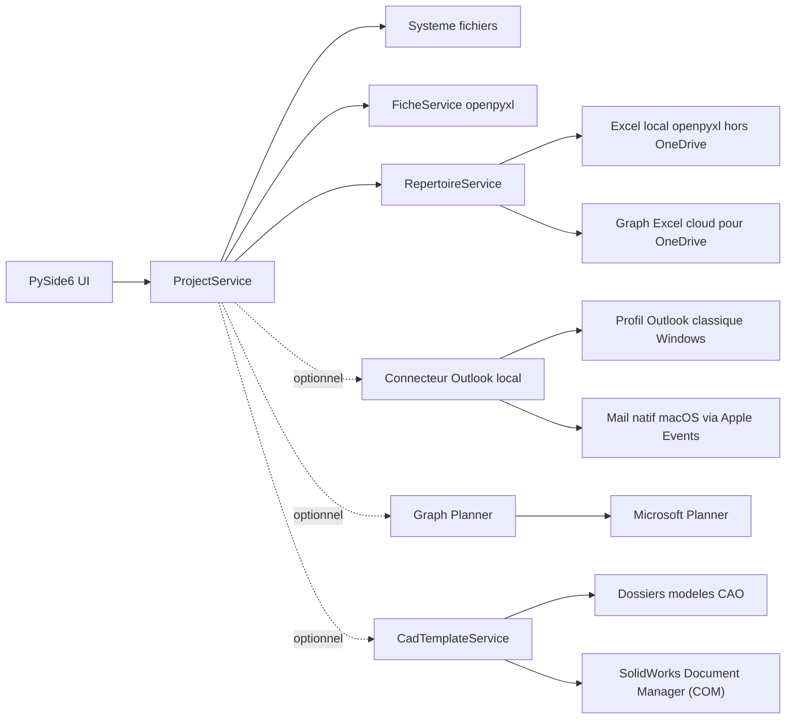
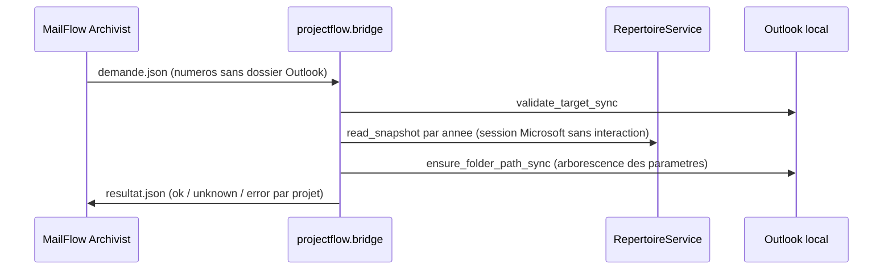
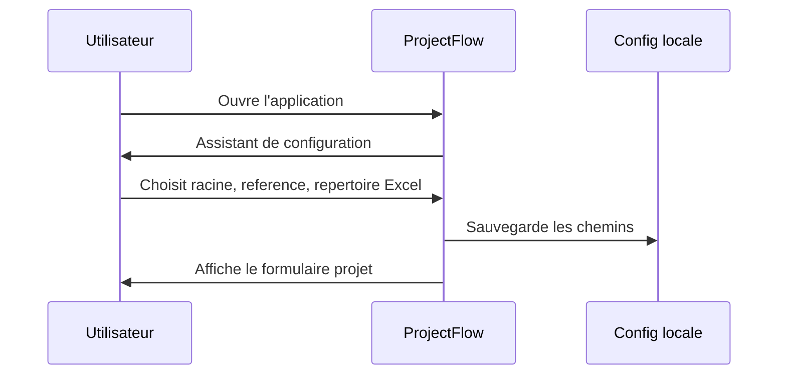
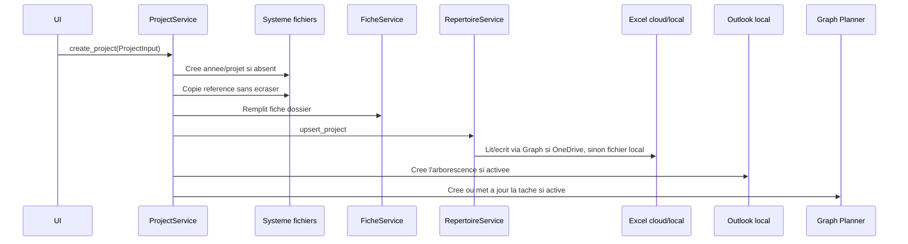
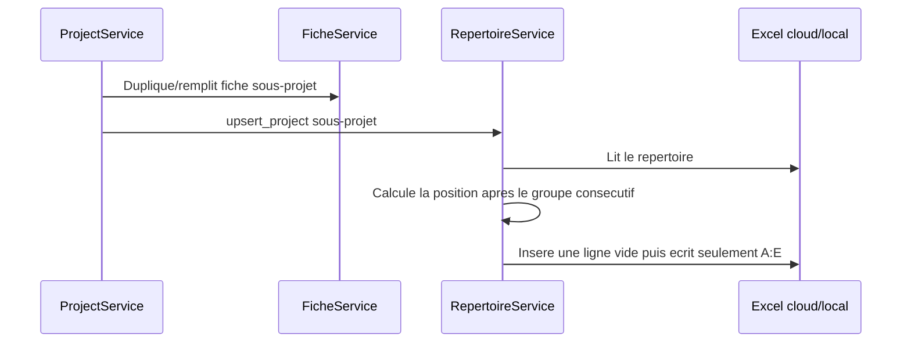

# Architecture

ProjectFlow separe strictement UI, logique metier et integrations locales.

Les operations CAO (`projectflow.cad`) tournent dans le thread de fichiers
(`run_file_io`). L'acces COM est isole derriere les protocoles de
`cad/solidworks_properties.py` ; les tests et le mode demo utilisent un faux Document Manager
(`cad/demo_document_manager.py`).

## Demandes de MailFlow Archivist

`projectflow.bridge` sert les demandes de MailFlow sans interface. `__main__` les
reconnait a `--mailflow-request` avant de creer la `QApplication` : pas de fenetre, pas
de transfert vers l'instance unique. La demande est un fichier JSON
(`protocol: 1`, `action: ensure_outlook_folders`, `numbers`), la reponse un autre
fichier ecrit par remplacement atomique, car l'executable fenetre n'a pas de console.

Seul un projet dont les colonnes B:E du repertoire sont renseignees recoit un dossier.
`ServiceContainer(interactive_sign_in=False)` transmet `allow_interactive=False` au
fournisseur MSAL : une session expiree devient une erreur explicite au lieu d'une page
de connexion. Les appels Outlook se font sur le fil principal du processus.

Avant de creer un dossier projet Outlook, `WindowsLocalOutlookClient` verifie son
emplacement habituel ; s'il n'y est pas, il cherche le numero dans tout le dossier de
base (six niveaux au plus, sans descendre dans les dossiers projet, hors Elements
supprimes et Courrier indesirable) et reutilise le dossier trouve, par exemple dans
`00-Archives/2026`, sans le renommer. Mail sur macOS garde le comportement precedent.

## Premier lancement

## Creation Projet Principal

## Sous-projet

